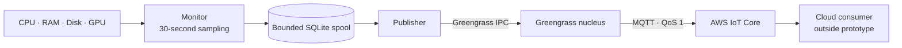

# Edge Hardware Monitor — Design

## Architecture

The monitor samples CPU, RAM, root-disk, and NVIDIA GPU utilization every 30 seconds. It records each sample—with a timestamp, hostname-based device ID, and unique sample ID—in a bounded local SQLite spool before writing it to stdout. When running as a Greengrass component, a background publisher sends queued samples through Greengrass IPC to AWS IoT Core using MQTT QoS 1. Without Greengrass IPC, it collects and stores locally.

Greengrass IPC reuses the device’s existing Greengrass connection and credentials instead of adding a separate MQTT connection or embedding cloud credentials in the application. SQLite provides local buffering while the monitor cannot hand samples to IPC. The spool is limited to 10,000 samples and seven days; the count limit can evict data sooner. GPU readings come from `nvidia-smi` for the first NVIDIA GPU and are `null` when unavailable.

## Trade-offs and delivery

1. A 30-second interval keeps collection lightweight, but can miss short-lived peaks. CPU readings represent the interval since the previous read; GPU utilization reflects the GPU tool’s recent measurement window. QoS 1 permits duplicate delivery, so consumers should deduplicate by `sample_id`.

2. The monitor removes a sample from SQLite after Greengrass IPC accepts the publish request. This confirms local handoff—not receipt by an AWS IoT Core consumer. Greengrass manages delivery after handoff under its own queue policy. The cloud consumer, storage, alerting, and stale-device detection are outside this prototype and must be selected for a deployed monitoring service.

3. I chose to make use of the existing Greengrass and AWS IoT configuration (described in the assignment document). This eliminates the need of additional set up for a MQTT broker (or HTTPS server) and configuring the communication parameters.  Moreover, AWS services such as Cloudwatch and Lambda can be useful with extending the monitor's capabilities. We can use Cloudwatch to set up dashboards and alarming and can integrate with Lambda and Greengrass in order to create autoremediation flows. These can be triggered automatically when one of the metrics are in alarm.

4. The current implementation only supports gathering metrics for NVIDIA GPUs. This is mostly due to the fact that different vendors expose different APIs and tools and those are generally not compatible with each other. To remain in the scope of the task, only NVIDIA support was implemented, but the `GpuCollector` class makes it easy to add support for other GPU types too.
5. I chose to run the monitor as a native Greengrass component rather than containerize it. This monitor needs host-wide CPU, RAM, disk, and NVIDIA GPU readings; a container can by default only expose container-scoped metrics unless host resources are explicitly shared. A containerized Greengrass component would also need the IPC socket and Greengrass identity passed into the container, plus NVIDIA container-runtime configuration for GPU access. Those requirements add permissions and deployment complexity without a clear benefit for this small collector.
# Scaling

At 1,000 devices and one sample every 30 seconds, the fleet produces about 33 samples per second, or 2.88 million samples per day. A cloud ingestion path should validate the schema, deduplicate samples, retain history only as needed, and track the latest observation per device. It should distinguish old replayed samples from fresh telemetry so delayed data does not hide a device that has stopped reporting. Staggering deployments and reconnects can reduce traffic bursts. Capacity, retention, and cost depend on the selected AWS destination and must be measured.

## Security

The component publishes through Greengrass IPC; it does not store AWS access keys. Its IPC authorization and the core device’s IoT policy should permit publishing only to that device’s intended topic. The prototype uses the OS hostname in `devices/{device_id}/metrics`; deployments should use a stable, commissioned device identity and keep topic authorization aligned with it. Protect the local spool with restrictive file permissions and appropriate host access controls. Avoid sending sensitive workload data in telemetry, and define retention and access controls for the cloud destination.