# Edge Hardware Monitor

A headless Linux prototype that periodically collects CPU, RAM, disk, and NVIDIA GPU utilization. It saves samples to a bounded SQLite spool and, when running as a Greengrass component, publishes them to AWS IoT Core through Greengrass IPC.

```mermaid
%%{init: {"theme": "base", "themeVariables": {"fontSize": "18px"}}}%%
flowchart LR
    subgraph Edge["Linux edge device"]
        direction TB
        hardware["Hardware metrics<br/>CPU · RAM · Disk · GPU"]
        monitor["Python monitor<br/>every 30 seconds"]
        spool[("Bounded SQLite spool")]
        publisher["Background publisher"]

        hardware --> monitor --> spool --> publisher
    end

    subgraph AWS["AWS"]
        direction TB
        nucleus["Greengrass nucleus"]
        iot["AWS IoT Core"]
        consumer["External monitoring consumer<br/>not included"]

        nucleus -->|"MQTT · QoS 1"| iot --> consumer
    end

    publisher -->|"Greengrass IPC"| nucleus

    classDef device fill:#EAF2FF,stroke:#4F6B95,color:#172B4D
    classDef storage fill:#FFF4D6,stroke:#A88732,color:#382C0B
    classDef cloud fill:#EAF7EF,stroke:#548365,color:#183A25

    class hardware,monitor,publisher device
    class spool storage
    class nucleus,iot,consumer cloud
```



## Features

- Samples CPU, RAM, root disk, and NVIDIA GPU utilization every 30 seconds.
- Logs a warning to stderr when any available metric is **greater than 90%**.
- Saves samples in a bounded local SQLite spool before printing them.
- Publishes queued samples through Greengrass IPC using MQTT QoS 1.
- Runs locally in spool-only mode when Greengrass IPC is unavailable.
- Has no UI dependencies or command-line arguments.

## Requirements

- Linux.
- Python 3.8 or newer.
- Python virtual-environment support (`venv`) for the selected interpreter.
- `nvidia-smi` and a compatible NVIDIA driver for GPU readings. Without them, GPU usage is reported as `null`.
- Dependencies listed in `requirements.txt`.

On Ubuntu, install Python and virtual-environment support using the packages appropriate for the version of Python your system runs. For example, `python3-venv` provides venv support for the default `python3`.
## Install and run locally

From the project folder:

```sh
python3 -m venv .venv
. .venv/bin/activate
python -m pip install -r requirements.txt
python edge_monitor.py
```

The monitor writes one JSON object per sample to stdout. Logs and threshold warnings go to stderr, so stdout can be consumed as a JSON-lines stream. Stop the process with Ctrl+C or SIGTERM.

Run the tests with:

```sh
python -m unittest discover -s tests -v
```

## Metrics and output

Each sample includes:

- `sample_id`: unique sample identifier for downstream deduplication.
- `timestamp`: UTC  timestamp.
- `device_id`: the device hostname.
- `cpu_usage_percent`
- `ram_usage_percent`
- `disk_usage_percent`
- `gpu_usage_percent`

CPU readings are non-blocking and reflect usage since the previous CPU read. Disk usage is measured for `/`. GPU usage is read from the first GPU reported by `nvidia-smi`; if the command or reading is unavailable, `gpu_usage_percent` is `null` while the other metrics continue to be collected.

The monitor logs a warning for each available CPU, RAM, disk, or GPU reading **above 90%**. A reading exactly at 90% does not trigger a warning. An unavailable GPU reading (`null`) is skipped. The threshold is defined by `USAGE_WARNING_THRESHOLD_PERCENT` in `constants.py`.

## Local SQLite spool

Samples are committed to SQLite before they are printed. By default, the database is stored at:

```text
~/.local/state/edge-monitor/metrics.sqlite3
```

Set `EDGE_MONITOR_SPOOL_PATH` to use a different database file:

```sh
export EDGE_MONITOR_SPOOL_PATH="$HOME/.local/state/edge-monitor/metrics.sqlite3"
python edge_monitor.py
```

The spool retains up to 10,000 samples and discards records older than seven days. When the count limit is exceeded, the oldest samples are dropped; therefore, the count limit may remove samples before the seven-day age limit. The database file is created with restrictive permissions where the operating system permits it.

For a Greengrass component, it is best to use the component's writable work directory rather than relying on the component user's home directory:

```yaml
Lifecycle:
  Setenv:
    EDGE_MONITOR_SPOOL_PATH: "{work:path}/metrics.sqlite3"
```

Keep this `Setenv` entry in every new component recipe version. Do not store the database in the read-only artifact directory.

## Greengrass and AWS IoT Core

When the Greengrass IPC socket environment variable is available, the monitor starts a background publisher. The publisher takes the oldest pending sample from SQLite and sends it through the Greengrass nucleus to AWS IoT Core on:

```text
devices/{device_id}/metrics
```

The publish uses the MQTT QoS value 1 (at-least-once). The component needs Greengrass IPC authorization for `aws.greengrass#PublishToIoTCore`, and the core device's AWS IoT policy must also allow publishing to the topic. Keep topic permissions as narrow as practical. The current prototype uses the hostname as `device_id`; a production fleet should use a stable, commissioned device identity and align the payload identity, topic, and authorization policy.

When the IPC publish request completes successfully, the monitor removes that sample from its SQLite spool. This confirms that Greengrass accepted the local publish request; it does **not** confirm that AWS IoT Core or a downstream consumer received or processed the message. Greengrass manages delivery after that handoff according to its MQTT spool configuration. A retry or interruption around the handoff can result in duplicate messages, so downstream consumers should deduplicate using `sample_id`.

Without Greengrass IPC, the monitor continues collecting and storing samples locally but does not publish them to AWS.

## Greengrass component deployment

The local component recipe and matching artifacts are under:

```text
greengrass/recipes/
greengrass/artifacts/com.example.EdgeMonitor/<version>/
```

The recipe runs the monitor as a Greengrass lifecycle process, creates a virtual environment in the component's writable work directory, and installs dependencies from the recipe's artifacts. The tested recipe selects `python3.8` if present; otherwise, it selects `python3` and checks that the selected interpreter is Python 3.8 or newer.

A local deployment on the Greengrass core device can be created from the repository root with:

```sh
sudo /greengrass/v2/bin/greengrass-cli deployment create \
  --recipeDir ./greengrass/recipes \
  --artifactDir ./greengrass/artifacts \
  --merge "com.example.EdgeMonitor=<version>"
```

Replace `<version>` with the version defined in the recipe filename and contents. Each component version is immutable; when changing the recipe or artifacts, create a new version and matching artifact directory. Keep the spool-path `Setenv` entry in every version.


For cloud-managed deployment to other devices, publish the component and make its matching artifacts available from a real S3 bucket accessible to those devices. A successful local deployment does not publish the component or upload artifacts for fleet deployment.

## Design limitations and production considerations

- The prototype's cloud consumer, long-term telemetry storage, dashboard, and stale-device alerts are not included.
- The application spool is bounded; samples may be expired or evicted when limits are reached.
- After Greengrass accepts a publish request, the application spool no longer owns that sample. Delivery beyond this handoff follows Greengrass's configured queue and retry behavior.

- Validate GPU readings under the deployed service user and on the target NVIDIA hardware.

At a 30-second sampling interval, 1,000 devices produce about 33 samples per second or 2.88 million samples per day, before retries and protocol overhead. A fleet deployment should account for ingestion capacity, retention, duplicate handling, burst traffic, and stale-device detection.

## Security

- The application uses Greengrass IPC rather than embedding AWS credentials in the source code.
- Restrict the component's IPC authorization and the core device's IoT policy to the intended publish topic.
- Protect the local SQLite spool with filesystem permissions and appropriate host access controls.
- Avoid including sensitive workload data in telemetry; define cloud-side retention and access controls.